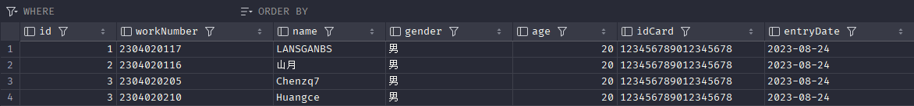
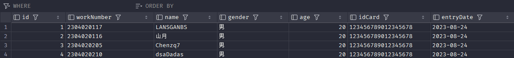
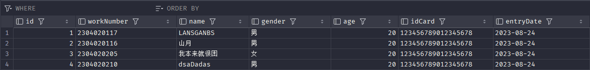
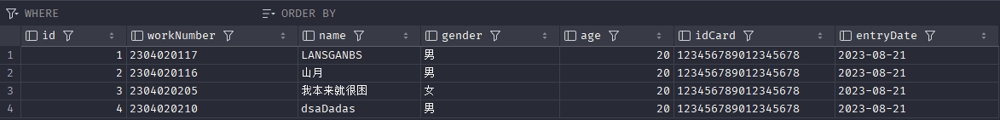
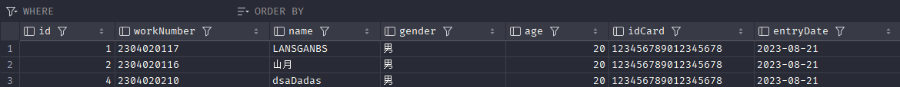

# DML

DML (Data Manipulation Language) - 数据操作语言：用于插入、更新、删除和查询数据库中数据的语言。

首先创建一个表 建表语句如下
```sql
create table employee(
    id int,
    workNumber varchar(10),
    name varchar(10),
    gender char(1),
    age tinyint unsigned,
    idCard char(18),
    entryDate date
);
```
- DML-添加数据
    1. 给指定字段添加数据
    ```sql
    insert into employee(id, workNumber, name, gender, age, idCard, entryDate) values(1,'2304020117','LANSGANBS','男',20,'123456789012345678','2023-08-24');
    ```
    字符串和日期类型需要用单引号包围

    2. 给全体字段添加数据
    ```sql
    insert into employee values(2,'2304020116','山月','男',20,'123456789012345678','2023-08-24');
    ```
  
    3. 批量添加数据
    ```sql
    insert into employee values(3,'2304020205','Chenzq7','男',20,'123456789012345678','2023-08-24'),(3,'2304020210','Huangce','男',20,'123456789012345678','2023-08-24');
    ```
    此时表结构
    

- DML-修改数据
    ```sql
    update employee set name = 'dsaDadas' where id = 3; -- 把id=3的数据的name修改为dsaDadas
    ```
    此时发现在上次批量添加数据时，添加了两条id=3的数据，此时进行修改
    ```sql
    update employee set id = 4 where workNumber = 2304020210;
    update employee set name = 'Chenzq7' where id = 3;
    ```
    此时表结构
    
    ```sql
    update employee set name = '我本来就很困', gender = '女' where id = 3; -- 把id=3的数据的name修改为我本来就很困，gender修改为女
    ```
    此时表结构
    
    ```sql
    update employee set entryDate = '2023-08-21'; -- 将所有人的enteyDate修改为2023-08-21
    ```
    此时表结构
    

- DML-删除数据
    ```sql
    delete from employee where gender = '女';
    ```
    此时表结构
    
    
    