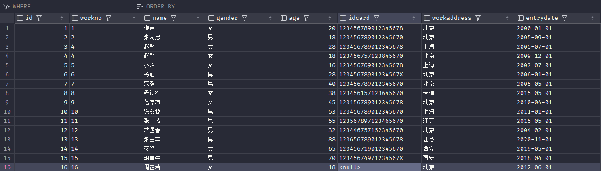
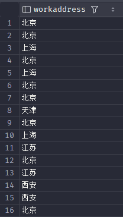
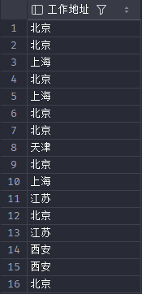
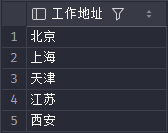
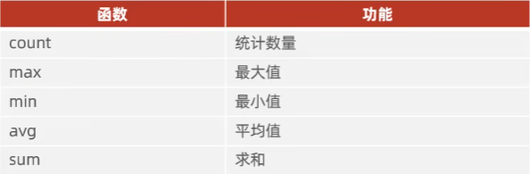

# DQL

DQL (Data Query Language) - 数据查询语言：用于查询数据库中数据的语言，主要指的是 SQL 中的 SELECT 语句。

首先删除之前创建的employee 之后创建一个表 语句如下
```sql
drop table employee;
create table emp(
    id int comment '编号',
    workno varchar(20) comment '工号',
    name varchar(20) comment '姓名',
    gender char(1) comment '性别',
    age tinyint unsigned comment '年龄',
    idcard char(18) comment '身份证号',
    workaddress varchar(50) comment '工作地址',
    entrydate date comment '入职日期'
)comment '员工表';
insert into emp(id, workno, name, gender, age, idcard, workaddress, entrydate)
values (1,'1','柳岩','女','20','123456789012345678','北京','2000-01-01'),
       (2,'2','张无忌','男','18','123456789012345670','北京','2005-09-01'),
       (3,'3','韦一笑','男','28','123456789012345678','上海','2005-07-01'),
       (4,'4','赵敏','女','18','123456757123845670','北京','2009-12-01'),
       (5,'5','小昭','女','16','123456769012345678','上海','2007-07-01'),
       (6,'6','杨逍','男','28','12345678931234567X','北京','2006-01-01'),
       (7,'7','范瑶','男','40','123456789212345670','北京','2005-05-01'),
       (8,'8','黛绮丝','女','38','123456157123645670','天津','2015-05-01'),
       (9,'9','范凉凉','女','45','123156789012345678','北京','2010-04-01'),
       (10,'10','陈友谅','男','53','123456789012345670','上海','2011-01-01'),
       (11,'11','张士诚','男','55','123567897123465670','江苏','2015;05-01'),
       (12,'12','常遇春','男',32,'123446757152345670','北京','2004-02-01'),
       (13,'13','张三丰','男',88,'123656789012345678','江苏','2020-11-01'),
       (14,'14','灭绝','女',65,'123456719012345670','西安','2019-05-01'),
       (15,'15','胡青牛','男',70,'12345674971234567X','西安','2018-04-01'),
       (16,'16','周芷若','女',18,null,'北京','2012-06-01');
```
此时表结构如下图所示

后续对创建语句进行了微调，因原表错误故修改了id=3的信息。

- DQL-基本查询
    1. 查询指定字段name, workno, age并返回
    ```sql
    select name,workno,age from emp;
    ```
    2. 查询所有字段并返回
    ```sql
    select id, workno, name, gender, age, idcard, workaddress, entrydate from emp;
    select * from emp -- 上述两者作用相同 *为通配符 但是尽量不要写* 因为不直观并且影响效率
    ```
    3. 查询所有员工的workaddress，起别名
    ```sql
    select workaddress from emp -- 直接查询
    ```
    
    ```sql
    select workaddress as '工作地址' from emp; -- 查询后起别名“工作地址”
    select workaddress '工作地址' from emp; -- as可以省略
    ```
    
    4. 查询所有员工的workaddress，不要重复
    ```sql
    select distinct workaddress '工作地址' from emp; -- distinct关键字用来去除重复记录
    ```
    
- DQL-条件查询
    1. 查询年龄等于88的员工
    ```sql
    select * from emp where age = 88;
    ```
    2. 查询年龄小于20的员工
    ```sql
    select * from emp where age < 20;
    ```
    3. 查询年龄小于等于20的员工
    ```sql
    select * from emp where age <= 20;
    ```
    4. 查询没有填写身份证号的员工
    ```sql
    select * from emp where idcard is null; -- 不能写idcard = null或者!idcard
    ```
    5. 查询所有填写身份证号的员工
    ```sql
    select * from emp where idcard is not null;
    ```
    6. 查询年龄不等于88的员工
    ```sql
    select * from emp where age != 88;
    select * from emp where age <> 88; -- !=和<>等效
    ```
    7. 查询年龄在15（包含）到20（包含）之间的员工
    ```sql
    select * from emp where age >= 15 and age <= 20;
    select * from emp where age >= 15 && age <= 20; -- and和&&等效
    select * from wmp where age between 15 and 20; -- between左右都包含并且and左边是小的，右边是大的
    ```
    8. 查询性别为女且年龄小于25的员工
    ```sql
    select * from emp where gender = '女' and age < 25;
    ```
    9. 查询年龄等于18或20或40的员工
    ```sql
    select * from emp where age = 18 or age = 20 or age = 40;
    select * from emp where age in(18,20,40);
    ```
    10. 查询姓名为2个字的员工
    ```sql
    select * from emp where name like '__'; -- _字符为占位符，匹配单个字符，两个_代表两个字符
    ```
    11. 查询身份证号最后一位是X的员工
    ```sql
    select * from emp where idcard like '%X'; -- %前面是什么无所谓，%匹配任意个字符
    select * from emp where idcard like '_________________X'; -- 一共17个_代表X前面有17个字符
    ```
    12. 查询身份证号中间有789的员工
    ```sql
    select * from emp where idcard like '%789%';
    ```
    13. 查询年龄在15（包含）到20（包含）之间，身份证号中间有789的员工
    ```sql
    select * from emp where age >= 15 and age <= 20 and idcard like '%789%';
    ```
- DQL- 聚合函数
    聚合函数：将一列数数据作为一个整体，进行纵向计算
    
    1. 统计该企业员工的数量
    ```sql
    select count(*) from emp;
    ```
    2. 统计该企业员工的平均年龄
    ```sql
    select avg(age) from emp;
    ```
    3. 统计该企业员工的最大年龄
    ```sql 
    select max(age) from emp;
    ```
    4. 统计该企业西安员工的年龄之和
    ```sql
    select sum(age) from emp where workaddress = '西安';    
    ```
- DQL-分组查询
    
    语法：
    ```sql
    select 字段列表 from 表名 [where 条件] group by 分组字段名 [having 分组后过滤条件];
    ```
    where和having的区别
    - 执行时机不同：where是分组之前进行过滤，不满足where条件，不参与分组；而having是分组之后的结果进行过滤。
    - 判断条件不同：where不能对聚合函数进行判断，而having可以。
    
    1. 根据性别分组，统计男性员工和女性员工的数量
    ```sql
    select gender, count(*) from emp group by gender;
    ```
    2. 根据性别分组，统计男性员工和女性员工的平均年龄
    ```sql
    select gender,avg(age) from emp group by gender;
    select gender, avg(age) from emp where gender = '男' or gender = '女' group by gender; -- 上述皆可
    ```
    3. 查询年龄小于45的员工，并根据工作地址分组，获取员工数量大于等于3的工作地址，并给地址数量起别名address_count
    ```sql
    select workaddress, count(*) address_count from emp where age < 45 group by workaddress having address_count>=3;
    ```
- DQL-排序查询
  
    语法：
    ```sql
    selete 字段列表 from 表名 order by 字段1 排序方式1,字段2 排序方式2;
    ```