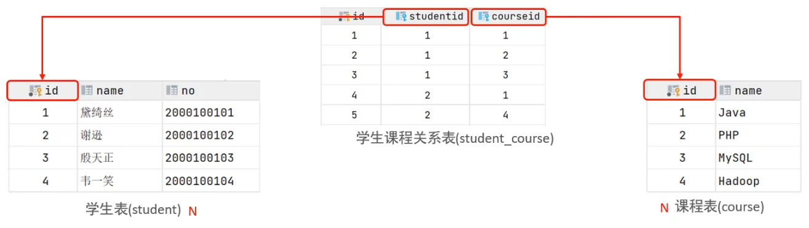
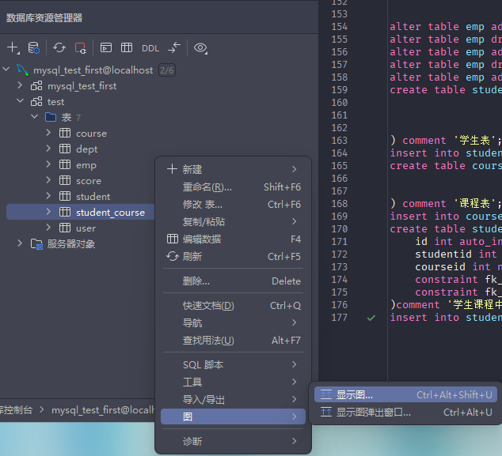
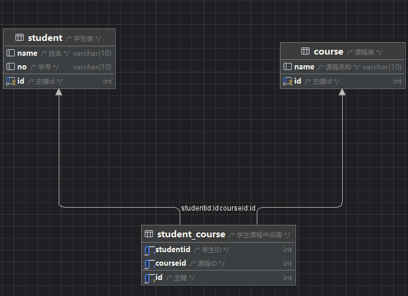
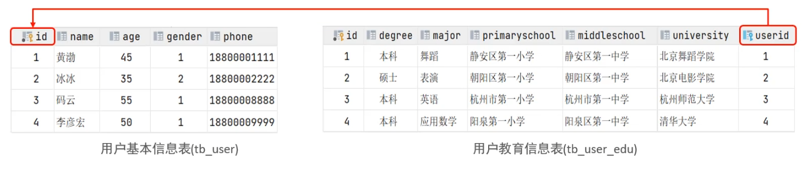
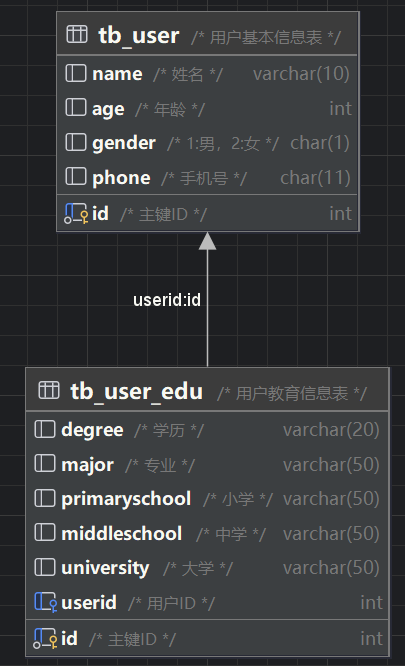

# 多表查询

### 多表关系
项目开发中，在进行数据库表结构设计时，会根据业务需求及业务模块之间的关系，分析并设计表结构。由于业务之间相互关联，所以各个表结构之间也存在各种联系，基本上分为三种：

- 一对多（多对一）
- 多对多
- 一对一

1. **一对多（多对一）**

- **案例**: 部门与员工的关系
- **关系**: 一个部门对应多个员工，一个员工对应一个部门
- **实现**: 在多的一方建立外键，指向一的一方的主键

2. **多对多**

- **案例**: 学生与课程的关系
- **关系**: 一个学生可以选修多门课程，一门课程也可以供多个学生选择
- **实现**：建立第三张中间表，中间表至少包含两个外键，分别关联两方主键



案例演示：
首先建两张表，学生表student和课程表course，语句如下
```sql
create table student (
                         id int auto_increment primary key comment '主键id',
                         name varchar(10) comment '姓名',
                         no varchar(10) comment '学号'
) comment '学生表';
insert into student values (null, '黛绮丝', '2000100101'), (null, '谢逊', '2000100102'), (null, '殷天正', '2000100103'), (null, '韦一笑', '2000100104');
create table course (
                        id int auto_increment primary key comment '主键id',
                        name varchar(10) comment '课程名称'
) comment '课程表';
insert into course values(null, 'Java'), (null, 'PHP'), (null, 'MySQL'), (null, 'Hadoop');
```
建立中间表student_course
```sql
create table student_course(
    id int auto_increment comment '主键' primary key,
    studentid int not null comment '学生ID',
    courseid int not null comment '课程ID',
    constraint fk_courseid foreign key (courseid) references course (id),
    constraint fk_studentid foreign key (studentid) references student (id)
)comment '学生课程中间表';
insert into student_course values (null,1,1),(null,1,2),(null,2,2),(null,2,3),(null,3,4);
```

创建如上三张表之后，可以按照如下操作直观地显示多表之间的关系



关系如下如所示



-关系图（Entity-Relationship Diagram，简称ER图）。ER图是一种用于描述数据库结构的图形化工具，它展示了实体（Entity）之间的关系。在ER图中，实体通常用矩形表示，属性（Attribute）用椭圆表示，关系（Relationship）用菱形表示，并且通过箭头连接实体来表示它们之间的关系。

3. **一对一**

- **案例**：用户与用户详情的关系
- **关系**：一对一关系，多用于单表拆分，将一张表的基础字段放在一张表中，其他详情字段放在另一张表中，以提升操作效率。
- **实现**：在任意一方加入外键，关联另外一方的主键，并且设置外键为唯一的(UNIQUE)。



案例演示：
建立两张表
```sql
create table tb_user (
                         id int auto_increment primary key comment '主键ID',
                         name varchar(10) comment '姓名',
                         age int comment '年龄',
                         gender char(1) comment '1:男，2:女',
                         phone char(11) comment '手机号'
) comment '用户基本信息表';
create table tb_user_edu (
                             id int auto_increment primary key comment '主键ID',
                             degree varchar(20) comment '学历',
                             major varchar(50) comment '专业',
                             primaryschool varchar(50) comment '小学',
                             middleschool varchar(50) comment '中学',
                             university varchar(50) comment '大学',
                             userid int unique comment '用户ID',
                             constraint fk_userid foreign key (userid) references tb_user(id)
) comment '用户教育信息表';
insert into tb_user(id, name, age, gender, phone) values
                                                      (null, '黄渤', 45, '1', '18880001111'),
                                                      (null, '冰冰', 35, '2', '18880002222'),
                                                      (null, '码云', 55, '1', '1880008888'),
                                                      (null, '李彦宏', 50, '1', '18800009999');
insert into tb_user_edu(id, degree, major, primaryschool, middleschool, university, userid) values
                                                                                                (null, '本科', '舞蹈', '静安区第一小学', '静安区第一中学', '北京舞蹈学院', 1),
                                                                                                (null, '硕士', '表演', '朝阳区第一小学', '朝阳区第一中学', '北京电影学院', 2),
                                                                                                (null, '本科', '英语', '杭州市第一小学', '杭州市第一中学', '杭州师范大学', 3),
                                                                                                (null, '本科', '应用数学', '阳泉第一小学', '阳泉区第一中学', '清华大学', 4);
```

