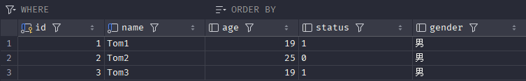

# 约束

### 概述

1. 概念：约束是作用于表中字段上的规则，用于限制存储在表中的数据。
2. 目的：保证数据库中数据的正确、有效性和完整性。
3. 分类：

| 约束      | 描述                           | 关键字         |
|---------|------------------------------|-------------|
| 非空约束    | 限制该字段的数据不能为 null             | not null    |
| 唯一约束    | 保证该字段的所有数据都是唯一、不重复的          | unique      |
| 主键约束    | 主键是一行数据的唯一标识，要求非空且唯一         | primary key |
| 默认约束    | 保存数据时，如果未指定该字段的值，则采用默认值      | default     |
| 检查约束    | 保证字段值满足某一个条件                 | check       |
| 外键约束    | 用来让两张表的数据之间建立连接，保证数据的一致性和完整性 | foreign key |

### 约束演示

- 根据需求完成表结创建

| 字段名    | 字段含义    | 字段类型        | 约束条件            | 约束关键字                       |
|--------|---------|-------------|-----------------|-----------------------------|
| id     | ID 唯一标识 | int         | 主键，并且自动增长       | primary key, auto_increment |
| name   | 姓名      | varchar(10) | 不为空，并且唯一        | not null, unique            |
| age    | 年龄      | int         | 大于 0，并且小于等于 120 | check                       |
| status | 状态      | char(1)     | 如果没有指定该值，默认为 1  | default                     |
| gender | 性别      | char(1)     | 无               |                             |
- 创建表
```sql
create table user(
    id int primary key auto_increment,
    name varchar(10) not null unique,
    age int check(age > 0 and age <= 120),
    status char(1) default '1',
    gender char(1)
); 
```
- 插入数据
```sql 
insert into user(name,age,status,gender) values ('Tom1',19,'1','男'),('Tom2',25,'0','男');
insert into user(name,age,status,gender) values ('Tom3',19,'1','男');
```
数据正确，可以正确插入


```sql
insert into user(name,age,status,gender) values (null,19,'1','男');
```
name存在约束not null


```sql
insert into user(name,age,status,gender) values ('Tom3',19,'1','男');
```
name存在约束unique


```sql
insert into user(name,age,status,gender) values ('Tom4',80,'1','男');
```
数据正确，可以正确插入
```sql
insert into user(name,age,status,gender) values ('Tom5',-1,'1','男');
insert into user(name,age,status,gender) values ('Tom5',121,'1','男');
```
age存在约束check(age > 0 and age < 120)


```sql
insert into user(name,age,gender) values ('Tom5',119,'男');
```
status存在约束，虽然不输入，但可以创建，默认值为1


### 外键约束
- **概念**  
  外键用来让两张表的数据之间建立连接，从而保证数据的一致性和完整性。

| id | name   | age | job     | salary | entrydate   | managerid | dept_id |
|----|--------|-----|---------|--------|-------------|-----------|---------|
| 1  | 金庸   | 66  | 总裁    | 20000  | 2000-01-01  | *null*    | 5       |
| 2  | 张无忌 | 20  | 项目经理 | 12500  | 2005-12-05  | 1         | 1       |
| 3  | 杨逍   | 33  | 开发    | 8400   | 2000-11-03  | 2         | 1       |
| 4  | 韦一笑 | 48  | 开发    | 11000  | 2002-02-05  | 2         | 1       |
| 5  | 常遇春 | 43  | 开发    | 10500  | 2004-09-07  | 3         | 1       |
*员工表 emp（子表/从表）*

| id | name   |
|----|--------|
| 1  | 开发部  |
| 2  | 市场部  |
| 3  | 财务部  |
| 4  | 销售部  |
| 5  | 总经办  |

*部门表 dept（父表/主表）*

*员工表 emp*的dept_id对应*部门表 dept*的id，两张表产生连接，具有外键的表成为子表，外键所关联的表成为父表。

**注意：目前上述的两张表，在数据库层面，并未建立外键关联，所以是无法保证数据的一致性和完整性的。**

- 数据准备
```sql
create table dept(
    id   int auto_increment comment 'ID' primary key,
    name varchar(50) not null comment '部门名称'
)comment '部门表';
INSERT INTO dept (id, name) VALUES (1, '研发部'), (2, '市场部'),(3, '财务部'), (4, '销售部'), (5, '总经办');


create table emp(
    id  int auto_increment comment 'ID' primary key,
    name varchar(50) not null comment '姓名',
    age  int comment '年龄',
    job varchar(20) comment '职位',
    salary int comment '薪资',
    entrydate date comment '入职时间',
    managerid int comment '直属领导ID',
    dept_id int comment '部门ID'
)comment '员工表';

insert into emp (id, name, age, job,salary, entrydate, managerid, dept_id) values
            (1, '金庸', 66, '总裁',20000, '2000-01-01', null,5),(2, '张无忌', 20, '项目经理',12500, '2005-12-05', 1,1),
            (3, '杨逍', 33, '开发', 8400,'2000-11-03', 2,1),(4, '韦一笑', 48, '开发',11000, '2002-02-05', 2,1),
            (5, '常遇春', 43, '开发',10500, '2004-09-07', 3,1),(6, '小昭', 19, '程序员鼓励师',6600, '2004-10-12', 2,1);
```
- 添加外键
```sql
create table 表名 (
    字段名 数据类型,
    ...
    [constraint] [外键名称] foreign key (外键字段名) references 主表 (主表列名)
);
```
```sql
alter table 表名 add constraint 外键名称 foreign key (外键字段名) references 主表 (主表列名);
```
- 删除外键
```sql
alter table 表名 drop foreign key 外键名称;
```
### 外键删除/更新行为

| 行为       | 说明                                                         |
|-----------|--------------------------------------------------------------|
| noaction   | 当在父表中删除/更新对应记录时，首先检查该记录是否有对应外键，如果有则不允许删除/更新。（与restrict一致） |
| restrict  | 当在父表中删除/更新对应记录时，首先检查该记录是否有对应外键，如果有则不允许删除/更新。（与noaction一致） |
| cascade   | 当在父表中删除/更新对应记录时，首先检查该记录是否有对应外键，如果有，则也删除/更新外键在子表中的记录。 |
| set null  | 当在父表中删除对应记录时，首先检查该记录是否有对应外键，如果有则设置子表中该外键值为null（这就要求该外键允许取null）。 |
| set default | 父表有变更时，子表将外键列设置成一个默认的值(InnoDB不支持)。 |
"noaction"和"restrict"为默认的，"set default"InnoDB不支持，**mysql不支持外键约束的"set default"操作**。
```sql
alter table 表名 add constraint 外键名称 foreign key(外键字段) references 主表名(主表字段名) on update cascade on delete cascade;
```

- 外键的删除和更新行为
```sql
alter table emp add constraint fk_emp_demp_id foreign key (dept_id) references dept(id) on update cascade on delete cascade;
alter table emp add constraint fk_emp_demp_id foreign key (dept_id) references dept(id) on update set null on delete set null;
```